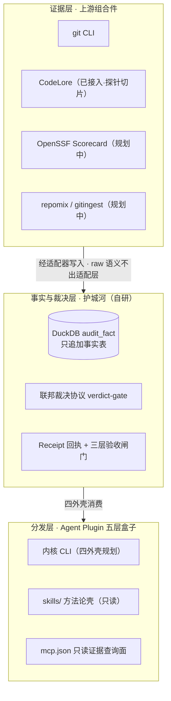
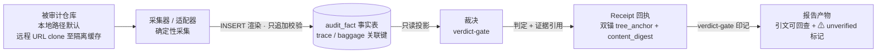

# macro-audit — 宏观 + 微观工程内容审计

面向 git 记录健全仓库的工程内容审计产品：**证据采集大部分来自上游组合件，裁决协议、事实表 schema、验收闸门与可核验回执是本项目自研的护城河与黏合剂**。5 档审计粒度（Macro-A 跨仓战略 / Macro-B 仓库级四象限 / Macro-C 演化考古 / Micro-A PR diff / Micro-B file level）共享同一事实底座与裁决层，差异在触发器与报告切片。

> [!NOTE]
> 当前状态（2026-09-15）：walking skeleton 已落地并通过 CI 硬验收（双 manifest 生成 / 编译 / 打包 / smoke 测活 / selftest）。**阶段 2/3（上游组合件接入与分发收尾）尚未开始**——下表标注「规划中」的上游尚未接入，请勿据本页认为产品已完成。

## 组合件架构（三层）



### 上游清单

| 上游组件 | 角色 | 形态 | 引入方式（D-020 双轨制） | 锁定策略 | 状态 |
|---|---|---|---|---|---|
| DuckDB（@duckdb/node-api） | 事实表底座 | Node 库 | 运行时依赖引用 | package-lock 精确锁定 | 已接入 |
| git CLI | 仓库考古 / 确定性采集 | 外部 CLI | 适配器 + 外部 CLI | 随宿主环境；输出解析为契约 | 已接入 |
| CodeLore | 代码考古 / 证据层 | CLI | 适配器 + 外部 CLI | exact pin 0.28.0 + golden 契约测试 | 已接入（探针切片：explain/summary 只读面） |
| OpenSSF Scorecard | 供应链健康评分 | Go 库 / CLI | 库→依赖引用；CLI→适配器 | hash pinning / 锁版本 | 规划中 |
| repomix / gitingest | 仓库内容打包摘要 | CLI / pip 包 | 适配器 + 外部 CLI | 锁版本 + golden 契约测试 | 规划中 |

引入方式按 ADR-0014：适配器 + 外部 CLI/库为主线，库形态上游走包管理器 lockfile hash pinning，vendor 源码进仓仅在气隙分发或上游废弃两种情况逃生。逐上游绑定与契约测试在阶段 2 立票定版。

## Runtime View（walking skeleton 当前数据流）



## 所有权边界

| 归属 | 组件 |
|---|---|
| **我们的（护城河）** | 联邦裁决协议（verdict-gate）· DuckDB 事实表 schema（只追加 + 跨 scale 关联键）· 三层验收闸门（A 形式 / B 预声明判据 / C 人裁定）· Receipt 回执（双锚）· 预声明判据纪律（2 正对照 + 3 真判据 + 1 负对照） |
| **借来的（上游）** | DuckDB 引擎本体 · git CLI · CodeLore（已接入·探针切片）· OpenSSF Scorecard（规划中）· repomix / gitingest（规划中） |

## 契约声明

- 上游组件一律**经适配器**写入事实表；上游原始语义不出适配层（防腐层纪律：适配层禁放业务规则）。
- 上游替换或升级**不得改动事实表 schema**——schema 不可变，演进只走版本号。
- 上游逐项锁定版本并配 golden 输出契约测试；vendor 源码进仓仅在气隙分发或上游废弃时启用，且必须带 UPSTREAM 清单与 patches/ 纪律。

## 仓库地图

| 路径 | 内容 |
|---|---|
| [CONTEXT.md](CONTEXT.md) | 术语表（54 词，领域唯一语言） |
| [docs/adr/](docs/adr/) | 架构决策记录 ADR-0001 ~ ADR-0018 |
| [engine/](engine/) | 内核 CLI + Agent Plugin 五层盒子（构建 / 命令细节见 [engine/README.md](engine/README.md)） |
| .scratch/macro-audit/ | 决策账本（D-001~D-036）+ spec 阶段任务 + 调研报告 |
| .scratch/architecture-recovery/ | 执行轮账本（A-001~A-048）+ 票据 / 守卫 / 首报产物 |

## 快速验证（源码自举，需 Node ≥ 20）

```bash
cd engine
npm install
npm test         # gen 双 manifest → tsc 编译 → smoke（启动并测活）
npm run selftest
```

CI 闭环见 [.github/workflows/engine-ci.yml](.github/workflows/engine-ci.yml)（paths: engine/**）。
