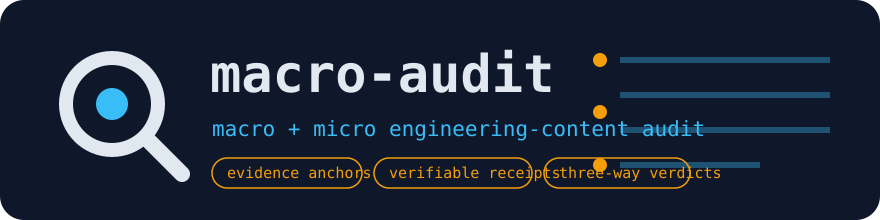
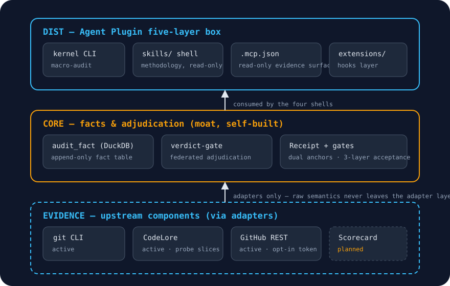
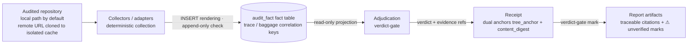

<p align="center">
  
</p>

<a id="macro-audit"></a>
# 6F

<p align="center">
  <a href="LICENSE"></a>
  
  
  <a href="#install"></a>
  <a href="https://github.com/Xxx91n/6F/actions/workflows/engine-ci.yml"></a>
</p>

<p align="center"><a href="README.md">English</a> &middot; <a href="README.zh-CN.md">&#31616;&#20307;&#20013;&#25991;</a></p>

Macro + micro engineering-content audit for git-healthy repositories — a **Claude Code Agent Plugin**. Evidence collection comes largely from upstream components; the adjudication protocol, fact-table schema, acceptance gates, and verifiable receipts are this project's self-built moat and glue. Five audit scales (Macro-A cross-repo strategy / Macro-B repo quadrant / Macro-C evolution archaeology / Micro-A PR diff / Micro-B file level) share one fact base and one adjudication layer — they differ in triggers and report slices.

## Highlights

- **Facts** — one append-only fact table collects every claim (Hub-of-Facts, ADR-0005).
- **Federation** — a federated verdict-gate protocol adjudicates every verdict (ADR-0005).
- **Forensics** — evolution archaeology digs repository history into evidence (Macro-C).
- **Five scales** — five audit granularities share that one fact base (ADR-0001).
- **Frankness** — preview, degraded, and `synthetic` marks label themselves (ADR-0017).
- **Fingerprints** — every verdict ships a dual-anchored, verifiable receipt.


> [!NOTE]
> Status (2026-09-20): **preview** (capability boundaries in the matrix below). Macro-B / Macro-C / Micro-A / Micro-B are in preview; Macro-A is **Not yet in preview** — roadmap narrative, not a usable promise. The plugin is installable today via the marketplace (`claude plugin marketplace add Xxx91n/6F` → `/plugin install 6f@xxx91n`; install & acceptance details in [engine/README.md](engine/README.md); the official-catalog track is unsubmitted and sits behind the owner's gate). The previous 「发布未发生·不存在可安装 listing」 state was ended by marketplace onboarding. Upstreams marked "planned" are not wired yet — do not read this page as a finished product. Product-facing surfaces (audit reports, listing copy) are primarily in Chinese; this file is the canonical English facade.

## Capability matrix

Release cadence = **graded preview releases** (ADR-0017): **build-scope ≠ release-sequence** — five audit scales are the full plan (ADR-0001 standing), each layer moves through its own preview→GA funnel, and a preview form is not an MVP slice.

| scale | status |
|---|---|
| Macro-B repo quadrant | **capability 1 of 5 · preview** (self-audit first report: [examples/first-report/](examples/first-report/)); quadrant slices: **strategy: active** (S1+S2 collectors live) · **behavior: preview** (codelore churn/hotspot/coupling slices, #51) · **structure: queued** (deferred on dual-caliber risk with the S3 family, D-054) · **supply-chain: queued** (D-034③ Scorecard does not skip the queue) |
| Macro-C evolution archaeology | **capability 2 of 5 · preview** (single-repo calibration disclosure) |
| Micro-A PR diff | **capability 3 of 5 · preview** (hosted-API adapter consumer side, same pilot-repo 4-PR calibration) |
| Micro-B file level | **capability 4 of 5 · preview** (file-audit card; same-owner pilot set=jiahao＋env-manager two-repo stitching/calibration — 同主偏差如实: both pilot repos share one maintainer; advisory-only structural isolation, advisory verdicts never reach gates) |
| Macro-A cross-repo strategy | Not yet in preview |

Honest preview labeling is a decision, not decoration (ADR-0017): report headers and sidecars carry a `preview_disclosure` block (capability tag + calibration scope + structural limits + not_in_preview list) sourced from the same semantics as the table above; degraded output carries a `⚠ unverified` mark, unwired evidence domains carry a "⚠ data not connected" note, and synthetic fixtures carry a `synthetic` mark — they never impersonate real audits.

**0.x semantics**: 0.x 单调递增、号不复用 (versions increase monotonically, never reused); minor = contract change, patch = fix, no patches backported to older lines. The 1.0 退出条件 (exit condition) = report schema frozen + every wired upstream adapter passing deterministic acceptance — not calendar-driven. Full policy in [docs/versioning.md](docs/versioning.md); product version history lives in [engine/CHANGELOG.md](engine/CHANGELOG.md), repo-level milestones/decision chronicle in [CHANGELOG.md](CHANGELOG.md).

## Install

**Prerequisites**: Node.js ≥ 20 (`node --version` to check) and Claude Code 2.x.

```text
/plugin marketplace add Xxx91n/6F
/plugin install 6f@xxx91n
```

Marketplace install = git clone with no build step — the runnable `dist/cli.js` (esbuild single-file bundle) ships with source, and a CI rebuild-diff guard catches forgotten rebuilds. Acceptance: `/mcp` shows `macro-audit-kernel` = connected, or run `node dist/cli.js selftest` in the plugin directory (5/5 = alive). Capability tiers and the DuckDB layered self-heal story (CLI auto-fetch vs. MCP `doctor --fix`) are documented in [engine/README.md](engine/README.md).

## What a report looks like

Excerpt from a real self-audit of this repository ([examples/first-report/23-first-report.md](examples/first-report/23-first-report.md)) — verdicts are reported, not rounded up:

```text
# MA-23-6F-FIRST-REPORT — Macro-B first report (6F@fc00d458…)
> RECEIPT RCP-9d20125ad0976c86  facts=228  adjudications=6
> issued_at=2026-09-13T14:31:09+08:00  commit=fc00d458e215…  tree=6f405cfc2ce5

- overall_verdict: unsupported        confidence: 0.75
- headline: main premise falsified at TC-2 (mean_ratio 0.2462 < 0.60,
  Status/Date missing 84.62%); TC-1 INCONCLUSIVE; TC-3 AMBER
```

## Quick verification

From source (Node ≥ 20):

```bash
cd engine
npm install
npm test         # gen manifests → tsc build → smoke (launch & liveness)
npm run selftest
```

CI loop: [.github/workflows/engine-ci.yml](.github/workflows/engine-ci.yml) (`paths: engine/**`).

---

## Architecture: three layers



The distribution layer (CLI, skills shell, MCP surface) consumes the self-built core — an append-only `audit_fact` DuckDB table, the `verdict-gate` federated adjudication protocol, and dual-anchored receipts. Evidence flows in only through adapters: upstream raw semantics never leaves the adapter layer.

## Upstream components

| upstream | role | form | integration (D-020 dual-track) | lock strategy | status |
|---|---|---|---|---|---|
| DuckDB（@duckdb/node-api） | fact-table base | Node library | runtime dependency | package-lock exact pin | 已接入（active） |
| git CLI | repo archaeology / deterministic collection | external CLI | adapter + external CLI | host environment; output parsing is the contract | 已接入（active） |
| CodeLore | code archaeology / evidence layer | CLI | adapter + external CLI | exact pin 0.28.0 + golden contract tests | 已接入（active; probe slices: explain/summary read-only surfaces） |
| OpenSSF Scorecard | supply-chain health score | Go lib / CLI | lib→dependency; CLI→adapter | hash pinning / locked version | 规划中（planned） |
| GitHub REST API | Micro-A PR data surface (enumeration/metadata/diff fallback; local git first) | remote-api | adapter + env token three-level probe | X-GitHub-Api-Version pin + golden cassette contract | 已接入（active） |

> **Status column = 机读权威绑定 (machine-readable binding)**: 唯一权威 = [`engine/upstream-lock.yaml`](engine/upstream-lock.yaml)（D-037③）——本表为人读形态，状态映射 = 已接入→active／规划中→planned／评估中→evaluating（retired rows are omitted; the lock file also carries evaluating row `codelore-sqlite-dump`）. Lock discipline: 禁 range/浮动 tag/latest，更新走手动窗口＋golden 回归护航 ([docs/versioning.md](docs/versioning.md) §3-4).

Integration follows ADR-0014: adapter + external CLI/library is the main line; library-form upstreams are pinned via package-manager lockfile hashes; vendoring source into the repo is an escape hatch reserved for air-gapped distribution or abandoned upstreams.

## Runtime view



## Ownership boundary

| owner | component |
|---|---|
| **Ours (the moat)** | federated adjudication protocol (verdict-gate) · DuckDB fact-table schema (append-only + cross-scale correlation keys) · three-layer acceptance gates (A formal / B pre-declared criteria / C human ruling) · dual-anchored receipts · pre-declared criteria discipline (2 positive controls + 3 real criteria + 1 negative control) |
| **Borrowed (upstream)** | DuckDB engine itself · git CLI · CodeLore (active, probe slices) · GitHub REST API (active, REST primary + `gh` optional fallback) · OpenSSF Scorecard (planned) |

## Contracts

- Upstream components write into the fact table **only through adapters**; upstream raw semantics never leaves the adapter layer (anti-corruption discipline: no business rules in adapters).
- Replacing or upgrading an upstream **must not change the fact-table schema** — the schema is immutable; evolution goes through version numbers only.
- Every upstream is version-pinned with golden output contract tests; vendored source enters the repo only for air-gapped distribution or abandoned upstreams, and must carry an UPSTREAM manifest and patches/ discipline.

## Repository map

| path | contents |
|---|---|
| [CONTEXT.md](CONTEXT.md) | glossary (domain language) |
| [docs/adr/](docs/adr/) | architecture decision records — 生成式索引 [docs/adr/README.md](docs/adr/README.md)（do not edit by hand；regen: cd engine && npm run gen） |
| [engine/](engine/) | kernel CLI + Agent Plugin five-layer box (build / command details in [engine/README.md](engine/README.md)) |
| [examples/first-report/](examples/first-report/) | release sample assets: 6F self-audit Macro-B first report, four files (happy + failure pair, disclosure regime) |
| [CHANGELOG.md](CHANGELOG.md) | 仓级里程碑/决策编年 (repo-level milestone & decision chronicle; pointer-based; product version ledger = engine/CHANGELOG.md) |
| .scratch/macro-audit/ | decision ledger D-series (`.scratch/macro-audit/decision-ledger.md`) + spec-phase tasks + research reports |
| .scratch/architecture-recovery/ | execution-round ledger A-series (`.scratch/architecture-recovery/decision-ledger.md`) + tickets / guards / first-report artifacts |

## Demo and examples

- **Deterministic demo** (zero external dependencies, discard after run): `node dist/cli.js demo` — a fixture generator synthesizes a temporary git repo and runs the Macro-B chain end to end; three scenarios via `node dist/cli.js demo --list` (happy-path / degraded-supply / degraded-incomplete). Synthetic fixtures carry a `synthetic` disclosure mark — **they do not impersonate real audits**.
- **Real first-report sample**: [examples/first-report/](examples/first-report/) — the 6F self-audit Macro-B run, four files (happy + failure pair), disclosing the generating commit, date, regeneration command, and freeze-point attributes.

## Try on a real repository

External repositories join via URL opt-in (D-013 local-first + URL opt-in): clone into an isolated cache (sha256 key) + full-depth verification + shallow clones rejected + remote-config execution disabled + local git credential chain reuse.

```bash
cd engine && npm install && npm run build
node dist/cli.js repo add https://github.com/open-gsd/gsd-core.git   # opt-in public repo
node dist/cli.js repo add /path/to/local/repo                        # local path (same intake leg)
```

- Opt-in public example: [open-gsd/gsd-core](https://github.com/open-gsd/gsd-core) (actually onboarded here: Macro-B one-shot on 2026-09-16 produced 1424 facts and an `unsupported` verdict faithfully recorded — TC-2 attributed to an ADR dash+bold form detector gap, registered as a coverage hole).
- **⚠ 外部内容随上游变化 (external content drifts with upstream)**: external repo content/structure evolves with its upstream, so audit readings cannot be golden-expected — the example demonstrates the intake path, not a promised verdict.
- Current `repo add` delivers the intake surface; the full audit pipeline for external repos currently runs as in-repo scripts (run records in the execution ledger A-044/A-045) and the packaged first-class command surface is not frozen — no fictional `audit` subcommand is claimed.

<!-- acknowledgments:start — GENERATED by engine/scripts/gen-acknowledgments.mjs; do not edit by hand (regen: node engine/scripts/gen-acknowledgments.mjs) -->
## Acknowledgments

6F stands on these upstream components — the active set of [engine/upstream-lock.yaml](engine/upstream-lock.yaml):

- **[CodeLore](https://github.com/emrecdr/codelore)** — code archaeology & evidence-layer external CLI (read-only explain/summary probe slices)
- **[DuckDB Node API](https://github.com/duckdb/duckdb-node)** — the fact-table base every audit scale writes through (@duckdb/node-api)
- **[DuckDB Node bindings](https://github.com/duckdb/duckdb-node)** — platform-native DuckDB binaries the fact store runs on (@duckdb/node-bindings-*)
- **[git](https://github.com/git/git)** — deterministic repository archaeology and evidence collection (external CLI, host-provided)
- **[GitHub REST API](https://docs.github.com/rest)** — the Micro-A PR data surface — enumeration / metadata / diff fallback, local git first
- **[esbuild](https://github.com/evanw/esbuild)** — single-file dist bundle builder for the packaged CLI
- **[SchemaStore](https://github.com/SchemaStore/schemastore)** — the claude-code-plugin-manifest schema, consumed as a snapshot-as-contract validation source
- **[Claude Code CLI](https://github.com/anthropics/claude-code)** — the advisory claude plugin validate toolchain

*The full upstream ledger — including planned / evaluating / retired rows — lives in [engine/upstream-lock.yaml](engine/upstream-lock.yaml). Legal attribution obligations are carried by NOTICE/license files; this section is the human credit surface only.*
<!-- acknowledgments:end -->

## Honesty notes

- **Badges show only what is true today**: license, version, Node floor, marketplace installability, and the engine-ci main-branch status badge (mounted 2026-09-22 after the first green main run — event-bound, not speculative). A motion GIF will be recorded against real UI after the listing-material freeze — not referenced before it exists.
- **Preview means preview**: capability labels, ⚠ marks, and `synthetic` marks are load-bearing honesty signals, retained verbatim across both language versions.
- **Two-layer facade**: the upper half of this file is the product facade; everything below the rule is the engineering layer (architecture, upstreams, runtime view, ownership, contracts, repo map) kept intact for evaluators verifying the goods.
