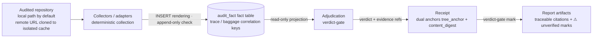

<!-- canonical: README.md | owner: Xxx91n -->
<!-- sync: 69e5b6eb1c72 -->
> ⚠ **本文件为中文译文（derived 工件）——英文版 [README.md](README.md) 为权威版本（canonical 权威源）；如有不一致以英文版为准。** 译文可暂时落后，但不假装新鲜（sync 戳与英文版内容指纹绑定）。

<p align="center">
  
</p>

<a id="macro-audit"></a>
# macro-audit — 宏观 + 微观工程内容审计 {#macro-audit}

<p align="center">
  <a href="LICENSE"></a>
  
  
  <a href="#install"></a>
</p>

<p align="center"><a href="README.md">English</a> &middot; <a href="README.zh-CN.md">&#31616;&#20307;&#20013;&#25991;</a></p>

面向 git 记录健全仓库的工程内容审计产品——**Claude Code Agent Plugin**：证据采集大部分来自上游组合件，裁决协议、事实表 schema、验收闸门与可核验回执是本项目自研的护城河与黏合剂。5 档审计粒度（Macro-A 跨仓战略 / Macro-B 仓库级四象限 / Macro-C 演化考古 / Micro-A PR diff / Micro-B file level）共享同一事实底座与裁决层，差异在触发器与报告切片。

> [!NOTE]
> 当前状态（2026-09-20）：**preview 形态**（能力边界见下节矩阵）——Macro-B / Macro-C / Micro-A 三层 preview；Micro-B / Macro-A 为 **Not yet in preview**（roadmap 叙事非可用承诺）。插件可经 marketplace 安装（`claude plugin marketplace add Xxx91n/6F` → `/plugin install 6f@xxx91n`，安装/验收口径见 [engine/README.md](engine/README.md)；B 轨官方目录未提交、走用户闸门）；「发布未发生·不存在可安装 listing」旧态已由 marketplace 上架终结。表中标注「planned」的上游尚未接入，请勿据本页认为产品已完成。产品语面（审计报告、listing 文案）以中文为主；本文件是 [README.md](README.md) 的派生译文。

<a id="capability-matrix"></a>
## 能力矩阵 {#capability-matrix}

发布节奏 = **Preview 分级发布**（ADR-0017）：**build-scope ≠ release-sequence**——5 档审计粒度为全规划（ADR-0001 standing），各层独立走 preview→GA 漏斗，preview 形态不构成 MVP 切片。

| scale | 状态 |
|---|---|
| Macro-B 仓库级四象限 | **capability 1 of 5 · preview**（自审首报样例见 [examples/first-report/](examples/first-report/)）；象限面矩阵：**strategy: active**（S1+S2 采集面已上架）· **behavior: preview**（codelore churn/hotspot/coupling 切片，#51）· **structure: queued**（与 S3 族双口径风险暂缓，D-054）· **supply-chain: queued**（D-034③ Scorecard 不插队） |
| Macro-C 演化考古 | **capability 2 of 5 · preview**（单仓校准披露口径） |
| Micro-A PR diff | **capability 3 of 5 · preview**（托管 API 适配器消费侧，同主试点仓 4-PR 校准口径） |
| Micro-B file level | Not yet in preview |
| Macro-A 跨仓战略 | Not yet in preview |

preview 标注诚实是决策本体非装饰（ADR-0017）：报告头/侧车 `preview_disclosure` 披露块（capability 标注＋校准范围＋结构性限制＋not_in_preview 清单）与上表为同一语义源；降级产出带 `⚠ unverified` 印记，未接证据域带「⚠ 数据未接」标注，合成 fixture 带「synthetic」印记且不冒充真实审计。

**0.x 语义**：版本号 0.x 单调递增、号不复用；minor = 契约变更、patch = 修复、不回退发旧线补丁；1.0 退出条件 = 报告 schema 冻结＋已接上游适配器全过确定性验收（非日历触发）。口径全文见 [docs/versioning.md](docs/versioning.md)；产品版本变更以 [engine/CHANGELOG.md](engine/CHANGELOG.md) 为准，仓级里程碑/决策编年见 [CHANGELOG.md](CHANGELOG.md)。

<a id="install"></a>
## 安装 {#install}

**前置**：Node.js ≥ 20（`node --version` 自检）；Claude Code 2.x。

```text
/plugin marketplace add Xxx91n/6F
/plugin install 6f@xxx91n
```

marketplace 安装 = git clone 无构建步——可运行体 `dist/cli.js`（esbuild 单文件 bundle）随源进仓，忘 rebuild 由 CI rebuild-diff 守卫拦截。验收：`/mcp` 确认 `macro-audit-kernel` = connected；或在插件目录 `node dist/cli.js selftest`（5/5 即活）。能力分级与 DuckDB 分层自愈口径（CLI 面自动补拉 vs MCP 面 `doctor --fix`）见 [engine/README.md](engine/README.md)。

<a id="what-a-report-looks-like"></a>
## 报告形态 {#what-a-report-looks-like}

本仓自审首报实物截片（[examples/first-report/23-first-report.md](examples/first-report/23-first-report.md)）——裁定如实落数，不为跑通而跑通：

```text
# MA-23-6F-FIRST-REPORT — Macro-B first report (6F@fc00d458…)
> RECEIPT RCP-9d20125ad0976c86  facts=228  adjudications=6
> issued_at=2026-09-13T14:31:09+08:00  commit=fc00d458e215…  tree=6f405cfc2ce5

- overall_verdict: unsupported        confidence: 0.75
- headline: main premise falsified at TC-2 (mean_ratio 0.2462 < 0.60,
  Status/Date missing 84.62%); TC-1 INCONCLUSIVE; TC-3 AMBER
```

<a id="quick-verification"></a>
## 快速验证 {#quick-verification}

源码自举（需 Node ≥ 20）：

```bash
cd engine
npm install
npm test         # gen manifests → tsc build → smoke (launch & liveness)
npm run selftest
```

CI 闭环见 [.github/workflows/engine-ci.yml](.github/workflows/engine-ci.yml)（`paths: engine/**`）。

---

<a id="architecture-three-layers"></a>
## 组合件架构（三层） {#architecture-three-layers}


分发层（CLI、skills 壳、MCP 面）消费自研核心——只追加 `audit_fact` DuckDB 事实表、`verdict-gate` 联邦裁决协议、双锚回执。证据只经适配器流入：上游原始语义不出适配层。

<a id="upstream-components"></a>
## 上游清单 {#upstream-components}

| 上游组件 | 角色 | 形态 | 引入方式（D-020 双轨制） | 锁定策略 | 状态 |
|---|---|---|---|---|---|
| DuckDB（@duckdb/node-api） | 事实表底座 | Node 库 | 运行时依赖引用 | package-lock 精确锁定 | 已接入（active） |
| git CLI | 仓库考古 / 确定性采集 | 外部 CLI | 适配器 + 外部 CLI | 随宿主环境；输出解析为契约 | 已接入（active） |
| CodeLore | 代码考古 / 证据层 | CLI | 适配器 + 外部 CLI | exact pin 0.28.0 + golden 契约测试 | 已接入（active；探针切片：explain/summary 只读面） |
| OpenSSF Scorecard | 供应链健康评分 | Go 库 / CLI | 库→依赖引用；CLI→适配器 | hash pinning / 锁版本 | 规划中（planned） |
| GitHub REST API | Micro-A PR 数据面（枚举/元数据/diff 兜底；本地 git 优先） | remote-api | 适配器 + env token 三级探测 | X-GitHub-Api-Version pin + golden cassette 契约 | 已接入（active） |

> **状态列 = 机读权威绑定**：唯一权威 = [`engine/upstream-lock.yaml`](engine/upstream-lock.yaml)（D-037③）——本表为人读形态，状态映射 = 已接入→active／规划中→planned／评估中→evaluating（retired 行不出本表；锁表另含评估中条目 `codelore-sqlite-dump`）。锁定纪律：禁 range/浮动 tag/latest，更新走手动窗口＋golden 回归护航（[docs/versioning.md](docs/versioning.md) §3-4）。

引入方式按 ADR-0014：适配器 + 外部 CLI/库为主线，库形态上游走包管理器 lockfile hash pinning，vendor 源码进仓仅在气隙分发或上游废弃两种情况逃生。

<a id="runtime-view"></a>
## Runtime View {#runtime-view}



<a id="ownership-boundary"></a>
## 所有权边界 {#ownership-boundary}

| 归属 | 组件 |
|---|---|
| **我们的（护城河）** | 联邦裁决协议（verdict-gate）· DuckDB 事实表 schema（只追加 + 跨 scale 关联键）· 三层验收闸门（A 形式 / B 预声明判据 / C 人裁定）· Receipt 回执（双锚）· 预声明判据纪律（2 正对照 + 3 真判据 + 1 负对照） |
| **借来的（上游）** | DuckDB 引擎本体 · git CLI · CodeLore（已接入·探针切片）· GitHub REST API（已接入·REST 主路+`gh` 可选回退）· OpenSSF Scorecard（规划中） |

<a id="contracts"></a>
## 契约声明 {#contracts}

- 上游组件一律**经适配器**写入事实表；上游原始语义不出适配层（防腐层纪律：适配层禁放业务规则）。
- 上游替换或升级**不得改动事实表 schema**——schema 不可变，演进只走版本号。
- 上游逐项锁定版本并配 golden 输出契约测试；vendor 源码进仓仅在气隙分发或上游废弃时启用，且必须带 UPSTREAM 清单与 patches/ 纪律。

<a id="repository-map"></a>
## 仓库地图 {#repository-map}

| 路径 | 内容 |
|---|---|
| [CONTEXT.md](CONTEXT.md) | 术语表（领域唯一语言） |
| [docs/adr/](docs/adr/) | 架构决策记录 ADR-0001 ~ ADR-0021 |
| [engine/](engine/) | 内核 CLI + Agent Plugin 五层盒子（构建 / 命令细节见 [engine/README.md](engine/README.md)） |
| [examples/first-report/](examples/first-report/) | 发布样例资产：6F 自审 Macro-B 首报四件（happy + failure 双对，披露制） |
| [CHANGELOG.md](CHANGELOG.md) | 仓级里程碑/决策编年（指针制；产品版本账以 engine/CHANGELOG.md 为准） |
| .scratch/macro-audit/ | 决策账本 D 系列（`.scratch/macro-audit/decision-ledger.md`）+ spec 阶段任务 + 调研报告 |
| .scratch/architecture-recovery/ | 执行轮账本 A 系列（`.scratch/architecture-recovery/decision-ledger.md`）+ 票据 / 守卫 / 首报产物 |

<a id="demo-and-examples"></a>
## 演示与样例 {#demo-and-examples}

- **确定性演示**（零外部依赖、跑完即弃）：`node dist/cli.js demo`——fixture 生成器合成临时 git 仓走 Macro-B 全链；三场景 `node dist/cli.js demo --list`（happy-path / degraded-supply / degraded-incomplete）。合成 fixture 带 synthetic 披露印记，**不冒充真实审计**。
- **真实首报样例**：[examples/first-report/](examples/first-report/)——6F 仓自审 Macro-B 实跑产物四件（happy + failure 双对），披露生成 commit / 日期 / 重生成命令与冻结时点属性。

<a id="try-on-a-real-repository"></a>
## 在真实仓库上试用 {#try-on-a-real-repository}

外部仓经 URL opt-in 接入（D-013 本地优先＋URL opt-in）：clone 至隔离缓存（sha256 键）＋全深度校验＋浅 clone 显式拒绝＋禁远程配置执行＋凭据复用本地 git 凭据链。

```bash
cd engine && npm install && npm run build
node dist/cli.js repo add https://github.com/open-gsd/gsd-core.git   # opt-in public repo
node dist/cli.js repo add /path/to/local/repo                        # local path (same intake leg)
```

- opt-in 公共仓示例：[open-gsd/gsd-core](https://github.com/open-gsd/gsd-core)（本仓已实测接入：2026-09-16 Macro-B one-shot 1424 facts，裁定 unsupported 如实落数——TC-2 归因为 ADR dash+加粗形态漏认，detector 覆盖缺口如实登记）。
- **⚠ 外部内容随上游变化**：外部仓内容/结构随其上游演化，审计读数不可 golden 预期——示例仅说明接入路径，不构成对特定裁定的承诺。
- 当前 `repo add` 交付 = intake 接入面；对外部仓的完整审计管线现以仓内脚本形态执行（实跑记录见执行账 A-044/A-045），打包内一等命令面未冻结——不虚构 `audit` 子命令。

<a id="honesty-notes"></a>
## 诚实注记 {#honesty-notes}

- **badge 只挂当下为真项**：license／version／Node 下限／marketplace 可安装。CI 徽记仅在对应 workflow 于 main 实跑绿后挂载（event_bound，不预埋）；动图待 listing-material-freeze 后拍真实 UI——两者存在前一律不引用。
- **preview 就是 preview**：capability 标注、⚠ 标记、`synthetic` 印记是承重诚实信号，跨语言原样保留。
- **双层门面**：本文件上半为产品门面层；分隔线下半为工程层（架构/上游/Runtime View/所有权/契约/仓库地图），为评估者验货完整保留。
